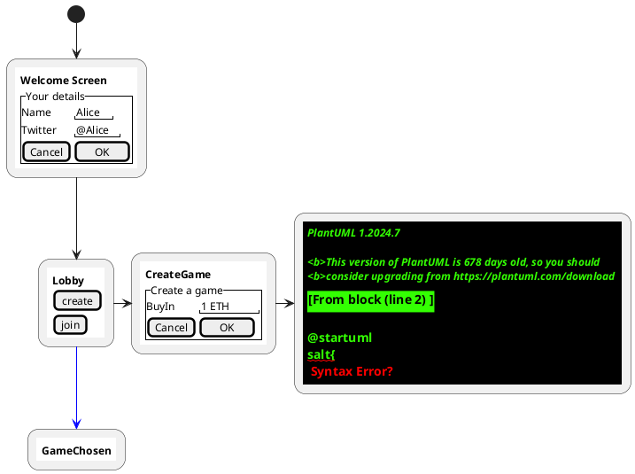

# Rock Paper Scissors explained with plantUML

```plantuml
@startuml
(*) --> "
{{
salt
{
<b>Welcome Screen
{^"Your details"
  Name    | "Alice"
  Twitter | "@Alice"
  [Cancel] | [  OK   ]
}
}
}}
" as Welcome

Welcome -down-> "
{{
salt
{
<b>Lobby
[create]
[join]
}
}}
" as Lobby

Lobby -right-> "
{{
salt
{
<b>CreateGame
{^"Create a game"
  BuyIn    | "1 ETH   "
  [Cancel] | [  OK   ]
}
}
}}
" as CreateGame

CreateGame -right-> "
{{
salt{
    <b>WaitingRoom
}
}}
" as WaitingRoom

Lobby -[#blue]-> "
{{
salt
{
<b>GameChosen
}
}}
" as GameChosen


@enduml
```
