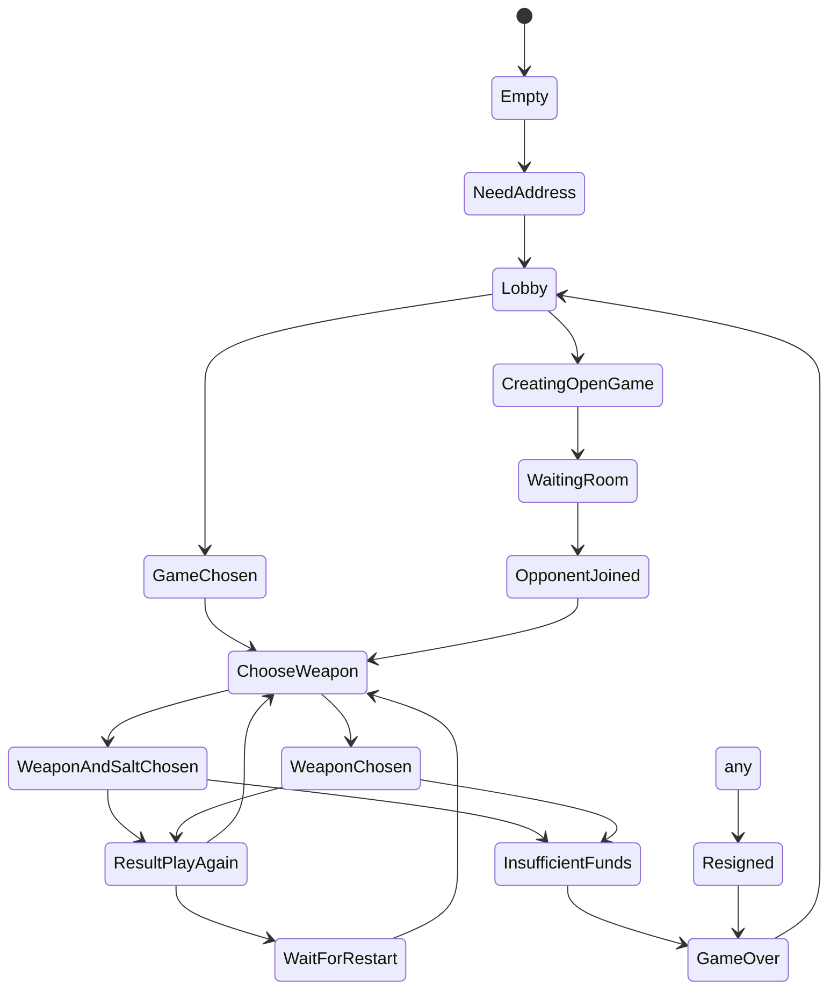
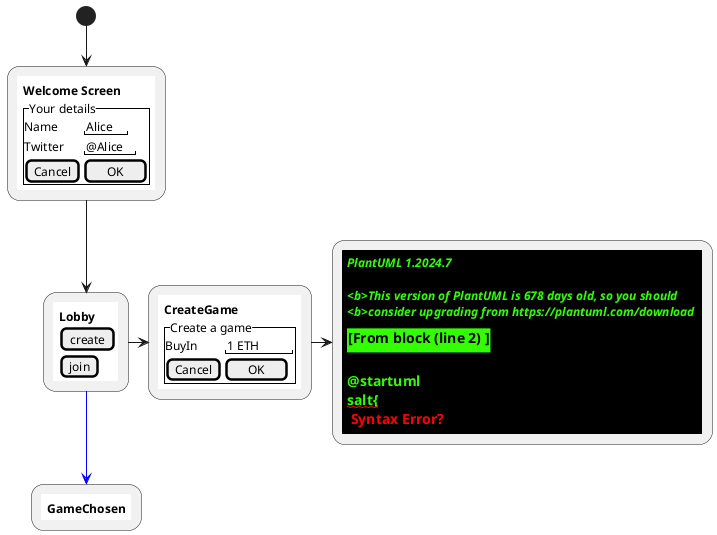

# How we built a rock paper scissors SCapp

# How to channelify your DApp

# How to build a state channel app

### that uses the statechannels nitro wallet



```nomnoml
    # edges: rounded
    [<start>]->[Empty]
    [Empty]->[NeedAddress]
    [NeedAddress]->[Lobby]
    [Lobby]->[GameChosen]
    [GameChosen]->[ChooseWeapon]
    [ChooseWeapon]->[WeaponChosen]
    [ChooseWeapon]->[WeaponAndSaltChosen]
    [WeaponAndSaltChosen]->[ResultPlayAgain]
    [WeaponChosen]->[ResultPlayAgain]
    [ResultPlayAgain]->[ChooseWeapon]
    [ResultPlayAgain]->[WaitForRestart]
    [WaitForRestart]->[ChooseWeapon]
    [WeaponAndSaltChosen]->[InsufficientFunds]
    [WeaponChosen]->[InsufficientFunds]
    [InsufficientFunds]->[GameOver]
    [Lobby]->[CreatingOpenGame]
    [CreatingOpenGame]->[WaitingRoom]
    [WaitingRoom]->[OpponentJoined]
    [OpponentJoined]->[ChooseWeapon]
    [any]->[Resigned]
    [Resigned]->[GameOver]
    [GameOver]->[Lobby]
```


